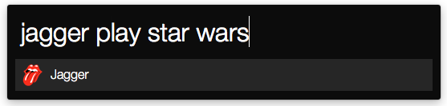
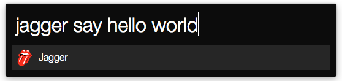

# Jagger


Jagger is a simple sound player written in Go. Once run, it listens on port
`8080` and plays the sound whose name matches the best with the search terms.
Simply put, it is like a self-hosted Giphy but for sounds. It is also able to
speak!

## [Alfred workflow](https://github.com/aseure/jagger/blob/master/alfred/Jagger.alfredworkflow?raw=true)




## Dependencies

 - [Mplayer](http://www.mplayerhq.hu/design7/news.html)
 - [Espeak](http://espeak.sourceforge.net/)

## Add sounds

Create a `sounds/` directory and put your `.mp3` or `.wav` in it. Actually, it
will work with every audio file that is supported by `mplayer`. To make the
search work, name your files with keywords. For instance, if you have the sound
file of the Imperial march from Star Wars, you could name it
`star-wars-imperial-march.mp3`.

## JSON Requests

### Play a sound

```
# Using curl
curl -d '{"command": "play", "params": "star wars"}' localhost:8080

# Using HTTPie
http localhost:8080 command="play" params="star wars"
```

### Say something

```
# Using curl
curl -d '{"command": "say", "params": "you can't always get what you want"}' localhost:8080

# Using HTTPie
http localhost:8080 command="play" params="you can't always get what you want"
```

### Stop the sound currently playing

```
# Using curl
curl -d '{"command": "stop"}' localhost:8080

# Using HTTPie
http localhost:8080 command="stop"
```
